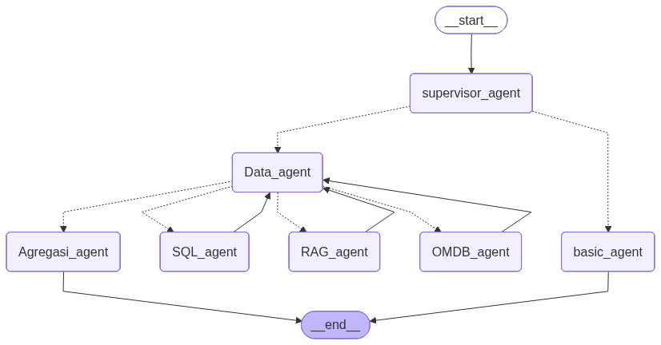

<div align="center">

# 🎬 CineAgent — Multi-Agent Movie Intelligence Chatbot

**A graph-orchestrated, multi-agent system that answers movie questions using SQL, vector search, and external APIs — powered by LangGraph, OpenAI, Qdrant, and Streamlit.**

[](https://python.org)
[](https://langchain.com)
[](https://langchain-ai.github.io/langgraph/)
[](https://openai.com)
[](https://qdrant.tech)
[](https://sqlite.org)
[](https://streamlit.io)
[](LICENSE)

---



*LangGraph agent orchestration flow — supervisor routes queries through specialized data agents*

</div>

---

## 📖 Overview

**CineAgent** is a multi-agent conversational AI system built to answer complex movie-related questions. It goes beyond simple Q&A by orchestrating multiple specialized agents through a **supervisor pattern** using **LangGraph's state graph**, combining structured data (SQL), unstructured knowledge (RAG via Qdrant), and real-time external data (OMDb API) into cohesive, informative responses.

The system is built on the **IMDB Top 1000 Movies** dataset and demonstrates real-world AI engineering patterns:

- **Hybrid retrieval** — SQL for structured queries (ratings, cast, revenue) + vector search for semantic queries (plot similarity, recommendations)
- **Multi-hop reasoning** — a routing agent dynamically chains data sources based on what information is still missing
- **Anti-loop guardrails** — deterministic safeguards prevent infinite agent cycles
- **Observability** — full tracing via Langfuse for debugging and evaluation

---

## ✨ Features

| | Feature | Description |
|---|---|---|
| 🧠 | **Supervisor Agent** | Classifies user intent and routes to the correct processing pipeline |
| 🔀 | **Dynamic Multi-Agent Routing** | Data agent evaluates partial results and decides which specialist to call next |
| 🗄️ | **SQL Agent** | Queries a structured SQLite database for cast, ratings, genres, revenue, and more |
| 📚 | **RAG Agent** | Retrieves semantically similar movie overviews from Qdrant vector database |
| 🔁 | **Reranking Pipeline** | Uses `Qwen3-Reranker-0.6B` cross-encoder to rerank retrieved documents for relevance |
| 🌐 | **OMDb API Agent** | Fetches supplementary movie data (awards, director, poster) from the OMDb API |
| 🧩 | **Aggregation Agent** | Synthesizes results from all data sources into a single coherent answer |
| 💬 | **Conversational UI** | Streamlit chat interface with session management and message history |
| 📊 | **Langfuse Observability** | Full trace logging for every agent call, enabling debugging and evaluation |
| 🛡️ | **Anti-Loop Guardrails** | Deterministic guards prevent agents from re-executing when their data is already collected |

---

## 🏗️ Architecture

CineAgent uses a **supervisor-orchestrated, graph-based multi-agent architecture** built with LangGraph.

### Agent Flow

```
User Query
    │
    ▼
┌─────────────────────┐
│  Supervisor Agent    │  ← Classifies: Data query or General chat?
└────────┬────────────┘
         │
    ┌────┴────┐
    ▼         ▼
┌────────┐ ┌────────────┐
│ Basic  │ │ Data Agent  │  ← Routes to the right specialist
│ Agent  │ │ (Router)    │
└───┬────┘ └──┬───┬───┬──┘
    │         │   │   │
    ▼         ▼   ▼   ▼
   END    ┌────┐┌───┐┌────┐
          │SQL ││RAG││OMDB│  ← Specialist agents loop back
          └──┬─┘└─┬─┘└──┬─┘    to Data Agent with results
             │    │     │
             └────┼─────┘
                  ▼
          ┌──────────────┐
          │  Aggregation  │  ← Synthesizes all results
          │    Agent      │
          └──────┬───────┘
                 ▼
                END
```

### How Routing Works

1. **Supervisor** uses structured output (`SupervisorOutput`) to classify intent → `Data_agent` or `basic_agent`
2. **Data Agent** uses structured output (`DataAgentOutput`) with chain-of-thought `reasoning` to decide which specialist to invoke next
3. After each specialist returns, control flows **back to the Data Agent**, which re-evaluates what's still missing
4. When all required data is collected, the Data Agent routes to the **Aggregation Agent** for final synthesis
5. **Guardrails** enforce forward progress — an agent that already returned data will never be called again

### Data Flow

```
┌─────────────┐     ┌──────────────┐     ┌──────────────────┐
│   SQLite     │     │ Qdrant Cloud │     │   OMDb REST API  │
│  (Structured)│     │   (Vectors)  │     │   (External)     │
│              │     │              │     │                  │
│  IMDB Top    │     │  Movie       │     │  Awards, Poster, │
│  1000 Films  │     │  Overviews   │     │  Detailed Info   │
│  Cast, Genre │     │  + Titles    │     │                  │
│  Rating, $   │     │              │     │                  │
└──────┬───────┘     └──────┬───────┘     └────────┬─────────┘
       │                    │                      │
       └────────────┬───────┘──────────────────────┘
                    ▼
           ┌────────────────┐
           │  Aggregation   │
           │     Agent      │
           └────────────────┘
```

---

## 📁 Project Structure

```
Capston3/
├── main.py                          # Streamlit app entry point
├── pyproject.toml                   # Project metadata & dependencies
├── arsitektur_agen.png              # Architecture diagram (LangGraph export)
├── LICENSE                          # MIT License
│
├── chatbot/                         # Core application package
│   ├── __init__.py
│   ├── config.py                    # LLM, embeddings, DB, Qdrant, reranker setup
│   ├── chatbot_result.py            # Streamlit ↔ LangGraph bridge with Langfuse tracing
│   │
│   ├── graph/                       # LangGraph orchestration
│   │   ├── state.py                 # TypedDict state schemas (AgentState, outputs)
│   │   ├── agent.py                 # All agent node implementations
│   │   └── graph.py                 # StateGraph wiring, edges, compilation
│   │
│   ├── prompt/                      # Prompt engineering
│   │   ├── supervisor.py            # Supervisor classification prompt
│   │   └── agent_prompt.py          # Prompts for Data, RAG, SQL, OMDB, Aggregation agents
│   │
│   ├── tools/                       # LangChain tool definitions
│   │   └── tool.py                  # RAG retrieval tool (+ reranking), OMDb API tool
│   │
│   ├── utils/                       # Data pipeline utilities
│   │   └── Process_data_tp_sql_and_qdrant.py  # ETL: CSV → SQLite + Qdrant ingestion
│   │
│   └── data/
│       ├── raw/                     # Source dataset
│       │   └── imdb_top_1000.csv    # IMDB Top 1000 movies dataset
│       └── process/                 # Processed database
│           └── IMDB_FILM_capston3.db  # SQLite database (structured film data)
│
└── eksperiment.ipynb                # Experimentation & prototyping notebook
```

---

## 🛠️ Tech Stack

| Layer | Technology | Purpose |
|---|---|---|
| **LLM** | GPT-4o-mini (OpenAI) | Reasoning, routing, aggregation |
| **Orchestration** | LangGraph | Stateful graph-based agent workflow |
| **Framework** | LangChain | Agent tooling, SQL toolkit, prompt management |
| **Vector DB** | Qdrant Cloud | Semantic search over movie overviews |
| **Embeddings** | OpenAI `text-embedding-3-small` | Document & query embedding |
| **Reranker** | Qwen3-Reranker-0.6B (CrossEncoder) | Relevance reranking of retrieved docs |
| **Structured DB** | SQLite + SQLAlchemy | Structured movie metadata queries |
| **External API** | OMDb API | Supplementary movie details (awards, posters) |
| **Observability** | Langfuse | Tracing, debugging, evaluation |
| **Frontend** | Streamlit | Conversational chat interface |
| **Package Manager** | uv | Fast Python dependency management |

---

## 🚀 Installation

### Prerequisites

- Python 3.12+
- [uv](https://docs.astral.sh/uv/) (recommended) or pip
- OMDb API key → [omdbapi.com](https://www.omdbapi.com/apikey.aspx)
- Qdrant Cloud account → [qdrant.tech](https://qdrant.tech)
- OpenAI API key → [platform.openai.com](https://platform.openai.com)

### Setup

```bash
# 1. Clone the repository
git clone https://github.com/HMAgiel/CineAgent.git
cd CineAgent

# 2. Install dependencies with uv
uv sync

# 3. Set up environment variables (see section below)
cp .env.example .env
# Edit .env with your API keys

# 4. Process the dataset (first-time only)
uv run python -m chatbot.utils.Process_data_tp_sql_and_qdrant

# 5. Run the application
uv run streamlit run main.py
```

---

## 🔑 Environment Variables

Create a `.env` file in the project root with the following keys:

```env
# Qdrant Vector Database
QDRANT_API="your-qdrant-api-key"
QDRANT_URL="https://your-cluster.cloud.qdrant.io"

# Langfuse Observability
LANGFUSE_SECRET_KEY="sk-lf-..."
LANGFUSE_PUBLIC_KEY="pk-lf-..."
LANGFUSE_BASE_URL="https://us.cloud.langfuse.com"

# LLM Providers
OPENAI_API_KEY="sk-proj-..."
DEEPSEEK_API_KEY="sk-..."           # Optional: alternative LLM
DASHSCOPE_API_KEY="sk-..."          # Optional: for Qwen models

# OMDb External API
OMDB_api_key="your-omdb-key"
OMDB_url="http://www.omdbapi.com/"
```

---

## 💻 Usage

### Running the Chatbot

```bash
uv run streamlit run main.py
```

The Streamlit app will open in your browser. Type any movie-related question to get started.

### Example Queries

| Query | Agents Triggered |
|---|---|
| `"What movies did Christopher Nolan direct?"` | Supervisor → Data → SQL → Aggregation |
| `"Tell me about sci-fi movies similar to Interstellar"` | Supervisor → Data → RAG → Aggregation |
| `"Top rated movies by Tom Hanks with plot summaries"` | Supervisor → Data → SQL → RAG → Aggregation |
| `"Awards won by The Godfather"` | Supervisor → Data → SQL → OMDB → Aggregation |
| `"What can you do?"` | Supervisor → Basic |

---

## 🔄 Example Workflow

Here's a realistic trace of how the system handles a complex multi-hop query:

> **User:** *"What are the highest rated Tom Hanks movies and what are they about?"*

```
1. 🎯 Supervisor Agent
   → Intent: Data query → routes to Data_agent

2. 🔀 Data Agent (Iteration 1)
   → Reasoning: "User wants ratings (SQL) + plot summaries (RAG). Start with SQL."
   → Routes to: SQL_agent

3. 🗄️ SQL Agent
   → Generates: SELECT Series_Title, IMDB_Rating FROM FILM_TABEL
                 WHERE Star1='Tom Hanks' OR Star2='Tom Hanks'
                 ORDER BY IMDB_Rating DESC LIMIT 10
   → Returns: Forrest Gump (8.8), Saving Private Ryan (8.6), ...

4. 🔀 Data Agent (Iteration 2)
   → Reasoning: "SQL done. User also wants overviews. RAG is empty."
   → needs_overview: true
   → Routes to: RAG_agent

5. 📚 RAG Agent
   → Rewrites query: "Forrest Gump Saving Private Ryan overview plot"
   → Retrieves top 5 from Qdrant → Reranks to top 3
   → Returns: plot summaries for matched titles

6. 🔀 Data Agent (Iteration 3)
   → Reasoning: "SQL ✓, RAG ✓ — all data collected."
   → Routes to: Agregasi_agent

7. 🧩 Aggregation Agent
   → Synthesizes SQL ratings + RAG overviews into a formatted response
   → Returns final answer to user
```

---

## 🧬 Engineering Highlights

<details>
<summary><b>🔀 Graph-Based Multi-Agent Orchestration</b></summary>

The system uses **LangGraph's `StateGraph`** to define a cyclic execution graph. Unlike linear chains, this allows the Data Agent to **dynamically loop** through specialists (SQL → RAG → OMDB) based on what data is still needed. Each iteration re-evaluates the state before routing.

```python
workflow.add_edge("SQL_agent", "Data_agent")   # Loop back
workflow.add_edge("RAG_agent", "Data_agent")   # Loop back
workflow.add_edge("OMDB_agent", "Data_agent")  # Loop back
```

</details>

<details>
<summary><b>🛡️ Deterministic Anti-Loop Guardrails</b></summary>

LLM-based routing can hallucinate loops (e.g., calling SQL again when it already returned data). The Data Agent implements **4 deterministic guardrails** that override LLM decisions:

1. **SQL Loop Prevention** — If SQL already ran, force-advance to RAG/OMDB/Aggregation
2. **RAG Skip Prevention** — If `needs_overview=True` but RAG hasn't run, force RAG
3. **OMDB Loop Prevention** — If OMDB already ran, force Aggregation
4. **RAG Loop Prevention** — If RAG already ran, force Aggregation

These guards ensure **finite execution** regardless of LLM behavior.

</details>

<details>
<summary><b>🎯 Structured Output for Reliable Routing</b></summary>

Both the Supervisor and Data Agent use **`with_structured_output()`** with TypedDict schemas, ensuring the LLM returns valid routing decisions rather than free-form text:

```python
class DataAgentOutput(TypedDict):
    reasoning: str          # Chain-of-thought explanation
    needs_overview: bool    # Whether RAG should be called
    data_worker: Literal["RAG_agent", "SQL_agent", "OMDB_agent", "Agregasi_agent"]
```

</details>

<details>
<summary><b>📚 Two-Stage Retrieval: Embedding + Reranking</b></summary>

The RAG pipeline uses a **two-stage retrieval** approach:

1. **Stage 1:** `text-embedding-3-small` embeds the query → Qdrant returns top-5 by cosine similarity
2. **Stage 2:** `Qwen3-Reranker-0.6B` cross-encoder rescores all 5 candidates → returns top-3 by relevance

This significantly improves retrieval precision over embedding-only search.

</details>

<details>
<summary><b>🗄️ Hybrid SQL + Vector Database Design</b></summary>

The IMDB dataset is split across two storage systems by data type:

- **SQLite** stores structured columns (title, cast, rating, genre, revenue) — ideal for filtering, sorting, and aggregation
- **Qdrant** stores movie overviews as dense vectors — ideal for semantic similarity and thematic search

The `film_id` UUID serves as a shared key across both stores, enabling cross-referencing.

</details>

<details>
<summary><b>📊 Full Observability with Langfuse</b></summary>

Every agent invocation is wrapped in a Langfuse observation span, providing:

- End-to-end trace visualization for each user query
- Per-agent latency and token usage metrics
- Input/output logging for debugging routing decisions
- Session-level grouping for multi-turn conversations

</details>

<details>
<summary><b>🔧 Iterative SQL Agent with Tool Calling</b></summary>

The SQL Agent doesn't use a single-shot query. It implements a **ReAct-style tool-calling loop** (up to 10 iterations) using LangChain's `SQLDatabaseToolkit`:

1. Inspect table schemas
2. Generate SQL
3. Execute and inspect results
4. Self-correct if needed

This makes it robust against schema mismatches and malformed queries.

</details>

---

## 🗺️ Future Improvements

- [ ] **Streaming responses** — Stream agent output token-by-token to the Streamlit UI
- [ ] **Persistent memory** — Replace `MemorySaver` with PostgreSQL-backed checkpointer for cross-session history
- [ ] **User authentication** — Add login to track per-user conversation history
- [ ] **Parallel agent execution** — Run SQL, RAG, and OMDB concurrently when the query requires all three
- [ ] **Evaluation pipeline** — Build automated eval suite using Langfuse datasets and LLM-as-judge
- [ ] **Expanded dataset** — Ingest full IMDB/TMDB datasets for broader movie coverage
- [ ] **Docker deployment** — Containerize with Docker Compose (Streamlit + Qdrant + SQLite)
- [ ] **Caching layer** — Cache frequent SQL queries and embeddings to reduce latency and API costs
- [ ] **Multi-model support** — Add DeepSeek / Qwen fallback for cost optimization

---

## 📄 License

This project is licensed under the **MIT License** — see the [LICENSE](LICENSE) file for details.

---

<div align="center">

## 👤 Author

**Hasyim Agiel**

[](https://github.com/HMAgiel)

---

*Built with ☕ and a passion for AI engineering*

</div>
